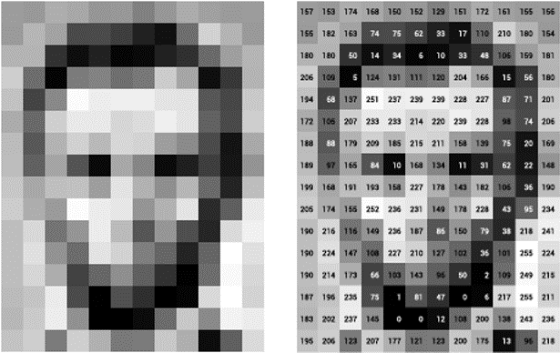

# Computer Vision

This repository comprises some of the fundamental concepts of OpenCV and computer vision projects, ranging from basic to advanced topics.

1. The [Basics OpenCV](https://github.com/parthsolanke/computer_vision/tree/main/Basics%20Open%20CV) folder provides an introduction to OpenCV library.
2. The folder [Advanced Open CV](https://github.com/parthsolanke/computer_vision/tree/main/Advanced%20Open%20CV) delves deeper into advanced concepts
3.  The [Computer Vision projects](https://github.com/parthsolanke/computer_vision/tree/main/Computer%20Vision%20projects) contains implementations of various projects, which are regularly updated with new ones.

(Note: For the ones wishing to check out the codes I've tried explaining the respective functions and their parameters in comments. For those interested in exploring the code, the functions and their respective parameters are explained in comments it's advisable to follow the numerical order in the filenames for a structured learning experience)
